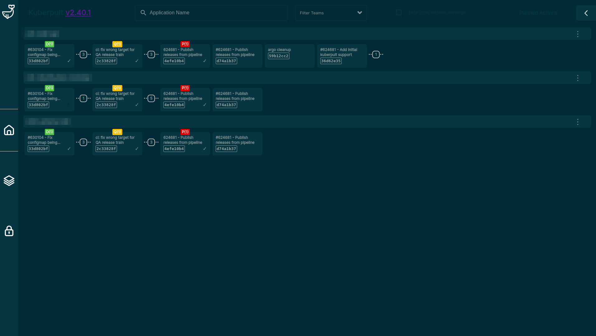

# KUBERPULT NOIR

0. Clone this repository
1. Set the `matches` field of [manifest.json](manifest.json) to point to where you keep your kuberpult
2. Open `chrome://extensions/` and turn on Developer Mode
3. Click `Load unpacked` and load it
4. Fix any issues you find and submit your changes, thx

